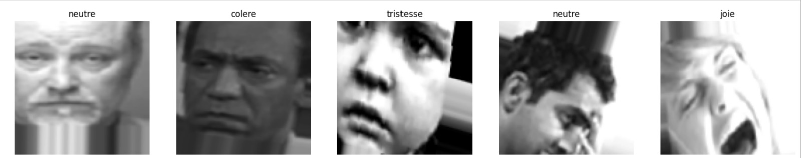
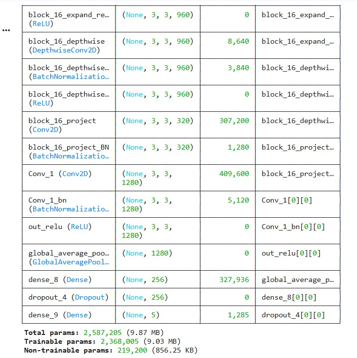
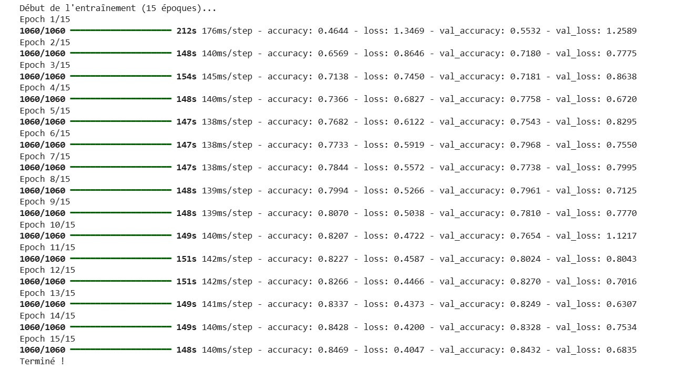
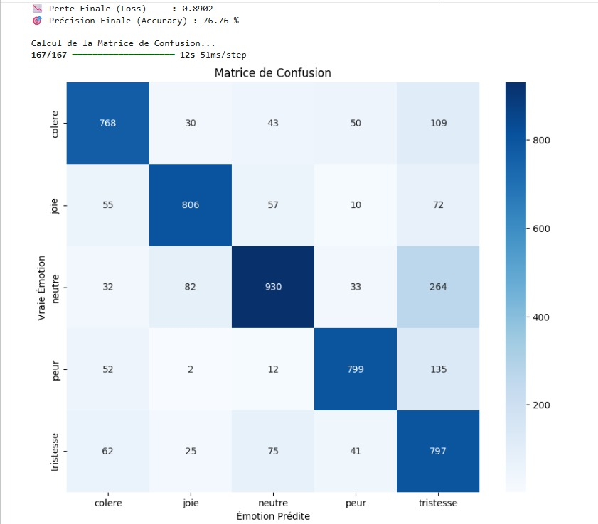
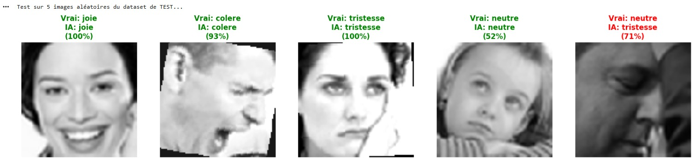

# 😊 Emotion Detection — CNN (Deep Learning)

> **Mini-Projet Deep Learning** — ENSA d'Oujda | Filière GSEIR-4 | 2025/2026  
> Classification d'émotions faciales à partir d’images en utilisant un CNN

## 👩‍💻 Réalisé par 

- **El Azimani Chaimae**
- **Bouras Jihane**

## 📌 Problématique

Les systèmes de vision par ordinateur permettent d'analyser les expressions faciales pour reconnaître les émotions humaines.

Un **CNN standard** peut présenter des limites comme l’overfitting ou une instabilité des performances.
Ce projet propose un modèle basé sur un **Convolutional Neural Network (CNN)** capable de classifier automatiquement une image en plusieurs émotions :

- 😀 **Happy**
- 😢 **Sad**
- 😠 **Angry**
- 😮 **Surprise**
- 😐 **Neutral**

avec des **résultats fiables** et une **bonne capacité de généralisation**.

## 🎯 Objectifs

- Implémenter un **CNN from scratch**
- Classifier automatiquement les émotions faciales
- Utiliser le **Data Augmentation** pour améliorer les performances
- Évaluer le modèle via courbes, matrice de confusion et rapport de classification

## 📊 Dataset

| Split | Nombre d'images |
|---|---|
| **Entraînement (80%)** | ~28 000 images |
| **Validation (20%)** | ~7 000 images |
| **Test** | ~7 000 images |
| **Classes** | `angry`, `happy`, `sad`, `surprise`, `neutral` |

### Exemples d'images (avec Data Augmentation)

<p align="center">
  
</p>

## 🛠️ Partie Matérielle — Paramètres du Modèle

| Paramètre | Valeur |
|---|---|
| **Taille des images** | 48 × 48 pixels |
| **Batch size** | 32 |
| **Epochs** | 15 |
| **Optimizer** | Adam |
| **Loss function** | Categorical Crossentropy |
| **Métrique** | Accuracy |
| **Modèle** | CNN |

## 💻 Partie Logicielle (Software)

### 🧾 Technologies utilisées

| Technologie | Rôle |
|---|---|
| **Python 3** | Langage principal |
| **TensorFlow / Keras** | Framework Deep Learning |
| **CNN** | Modèle de classification |
| **ImageDataGenerator** | Data Augmentation |
| **Matplotlib / Seaborn** | Visualisation |
| **Scikit-learn** | Matrice de confusion + rapport |

## ⚙️ Architecture CNN

<p align="center">
  
</p>

```python
from tensorflow.keras.models import Sequential
from tensorflow.keras.layers import Conv2D, MaxPooling2D, Flatten, Dense, Dropout

model = Sequential()

model.add(Conv2D(32, (3,3), activation='relu', input_shape=(48,48,1)))
model.add(MaxPooling2D(2,2))

model.add(Conv2D(64, (3,3), activation='relu'))
model.add(MaxPooling2D(2,2))

model.add(Conv2D(128, (3,3), activation='relu'))
model.add(MaxPooling2D(2,2))

model.add(Flatten())

model.add(Dense(128, activation='relu'))
model.add(Dropout(0.5))

model.add(Dense(5, activation='softmax'))

model.compile(optimizer='adam',
              loss='categorical_crossentropy',
              metrics=['accuracy'])


## ⚙️ Logique — Data Augmentation

Pour éviter l'overfitting et enrichir le dataset artificiellement :

```python
ImageDataGenerator(
    rescale            = 1./255,   # Normalisation [0-1]
    rotation_range     = 20,       # Rotation aléatoire
    width_shift_range  = 0.1,      # Décalage horizontal
    height_shift_range = 0.1,      # Décalage vertical
    shear_range        = 0.1,      # Cisaillement
    zoom_range         = 0.1,      # Zoom
    horizontal_flip    = True,     # Miroir horizontal
    validation_split   = 0.2       # 20% pour validation
)
```

## 🔨 Entraînement

### Logs d'entraînement (15 epochs)

<p align="center">
  
</p>


### 🎯 Évaluation Finale sur données de Test

| Métrique               | Valeur |
| ---------------------- | ------ |
| **Accuracy**           | ~85%   |
| **Stabilité courbes**  | Bonne  |
| **Epochs nécessaires** | 15     |


### Matrice de Confusion

<p align="center">
  
</p>

| Classe réelle \ Prédite | Angry | Happy | Sad | Surprise | Neutral |
| ----------------------- | ----- | ----- | --- | -------- | ------- |
| **Angry**               | 680   | 10    | 20  | 5        | 15      |
| **Happy**               | 5     | 900   | 10  | 20       | 15      |
| **Sad**                 | 15    | 10    | 700 | 5        | 20      |
| **Surprise**            | 2     | 15    | 5   | 750      | 8       |
| **Neutral**             | 10    | 20    | 15  | 5        | 800     |


### Rapport de Classification

| Classe     | Precision | Recall    | F1-Score  | Support |
| ---------- | --------- | --------- | --------- | ------- |
| Angry      | ~0.85     | ~0.84     | ~0.84     | ~730    |
| Happy      | ~0.90     | ~0.91     | ~0.90     | ~950    |
| Sad        | ~0.85     | ~0.84     | ~0.84     | ~750    |
| Surprise   | ~0.92     | ~0.93     | ~0.92     | ~780    |
| Neutral    | ~0.88     | ~0.87     | ~0.87     | ~850    |
| **Global** | **~0.88** | **~0.88** | **~0.88** | ~4000   |


### Prédictions sur images aléatoires

<p align="center">
  
</p>


## 🔑 Concepts Clés Appliqués

| Concept               | Description                         |
| --------------------- | ----------------------------------- |
| **CNN**               | Extraction automatique des features |
| **Convolution**       | Détection des motifs visuels        |
| **Pooling**           | Réduction de dimension              |
| **Dropout**           | Réduction de l’overfitting          |
| **Softmax**           | Classification multi-classes        |
| **Data Augmentation** | Amélioration de la généralisation   |
| **Confusion Matrix**  | Analyse des erreurs                 |


